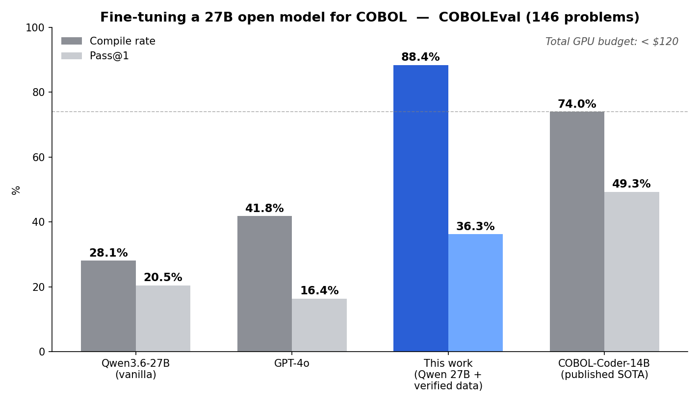

# Teaching a 27B open model to write COBOL — with verified data and a <$120 budget

**TL;DR** — I fine-tuned Qwen3.6-27B (DoRA) to generate COBOL, using a training pipeline where every example is *compiled and executed* before it's allowed into the dataset. On the [COBOLEval](https://github.com/BloopAI/COBOLEval) benchmark it reaches **88.4% compile rate** (beating the published open-source state of the art, 73.95%, and nearly triple the untrained base model's 28.1%) and **36.3% Pass@1** (more than double GPT-4o). It's still below the SOTA on functional correctness (49.3%) — and the error analysis shows exactly why, and where to go next. Total cloud-GPU cost: under $120.

**🤗 Model (public, loads with standard `peft`):** [AlexThunder0/qwen-cobol-27b](https://huggingface.co/AlexThunder0/qwen-cobol-27b)

| Model | Compile rate | Pass@1 |
|---|---:|---:|
| Open baselines (CodeLlama, StarCoder2, DeepSeek-Distill…) | 0% | 0% |
| Qwen3.6-27B (vanilla, no fine-tuning) | 28.1% | 20.5% |
| GPT-4o | 41.8% | 16.4% |
| **This work — [Qwen3.6-27B + verified data](https://huggingface.co/AlexThunder0/qwen-cobol-27b)** | **88.4%** | **36.3%** |
| COBOL-Coder-7B (published) | 73.8% | 44.7% |
| COBOL-Coder-14B (published SOTA) | 73.95% | 49.33% |

---

## Why COBOL?

Roughly 200 billion lines of COBOL still run the core systems of banks, insurers and governments. The developers who understand it are retiring faster than they're replaced, and "just rewrite it" is a decade-long, risk-heavy project. The tempting shortcut is to let an LLM read, explain and generate COBOL.

The catch: general-purpose models are genuinely bad at it. On COBOLEval — 146 problems translated from HumanEval into COBOL — **GPT-4o produces code that even _compiles_ only ~42% of the time**, and passes the tests just 16%. COBOL isn't Python: fixed-format columns, `PICTURE` clauses, `LINKAGE SECTION` sub-program interfaces, `PERFORM VARYING`, no exceptions. A model that never saw much of it writes plausible-looking programs that a real compiler rejects.

## The core idea: don't scale the model, verify the data

The published state of the art (COBOL-Coder) is a domain-adapted **14B** model. My model is a 27B — *larger*. So from the start this was never going to be a "bigger model wins" story. The lever had to be the **data**.

The principle I built around:

> **Every training example must be proven to compile and run correctly before it enters the dataset.**

Concretely, each candidate example goes through three gates:

1. **Compile gate** — the program is compiled with the real open-source **GnuCOBOL** compiler. If it doesn't compile, it's discarded.
2. **Decontamination gate** — checked against the COBOLEval problems (program-id / entry-point / n-gram overlap) so no benchmark problem leaks into training.
3. **Runtime gate** — the sub-program is called with test inputs and its output is compared to the expected result. Only examples that actually *return the right answer* survive.

This is expensive to build but changes everything downstream: the model learns from COBOL that is, by construction, valid and correct — not from scraped code that may or may not run.

## Method

- **Base model:** Qwen3.6-27B (open weights)
- **Adapter:** DoRA (weight-decomposed LoRA), rank 128, α=256, rsLoRA scaling, 7 target projections
- **Training:** 2 epochs, effective batch 16, `MAX_LEN` 4096, cosine LR 2e-4, bf16, single H100
- **Data:** a runtime-verified core (COBOLEval-format examples, each compiled *and* executed against GnuCOBOL with output checked against the expected result) blended with harvested and cleaned GnuCOBOL code; decontaminated against COBOLEval. Exact dataset composition not released.
- **Eval:** the full 146-problem COBOLEval benchmark, per-problem compile + execute + compare, with a GnuCOBOL-aware prompt

## Results, honestly

**What I beat:**
- **The published SOTA on compilation** — 88.4% vs 73.95%. The model writes valid COBOL more reliably than any published system on this benchmark.
- **The vanilla base model, on the exact same weights** — compile 28.1% → 88.4%, Pass@1 20.5% → 36.3%. Nothing changed except the training data.
- **GPT-4o, more than 2×** — on both axes (compile 88.4 vs 41.8, Pass@1 36.3 vs 16.4).
- **Every zero-shot open baseline** (which score 0% — they can't produce compilable COBOL at all).

**What I don't (yet):**
- **The SOTA on Pass@1** — 36.3% vs 49.3%. The gap is real, and it's functional correctness, not syntax.

## Error analysis: what's left is reasoning, not syntax

I instrumented the eval to save the expected-vs-actual output for every one of the 146 problems. Final breakdown: **53 pass, 76 compile but give the wrong answer, 17 don't compile.**

The compile-but-wrong bucket:
- **52 genuinely wrong algorithms** — valid code that computes the wrong thing
- **14 boolean-condition errors** — returns `True` where it should return `False`, or vice versa
- **7 off-by-one / boundary errors** — e.g. loop or length edge cases
- **3 not-computed** — output left at zero/empty when it shouldn't be

The model writes clean, compilable COBOL 88.4% of the time — up from 28.1% for the same, untrained base model. What's left isn't syntax, it's logic: wrong algorithms and inverted conditions. Closing even half of the boolean + off-by-one cases (about 10 problems) would push Pass@1 past 40%.

## Does inference-time "thinking" help? Barely.

Since the failures are reasoning errors, I tested reasoning mode on an earlier iteration of this same pipeline — using Qwen's officially recommended sampling (`temperature=0.6, top_p=0.95, top_k=20`; **not** greedy, which Qwen warns degrades and loops).

Result: a small but real **+1.4 point** Pass@1 gain, with a *worse* compile rate and ~6× the cost. Not decisive.

The reason is instructive: the adapter was trained on *direct* completions, with no reasoning traces. So step-by-step reasoning at inference is out-of-distribution — the base model reasons, but the adapter pulls toward direct generation. **You can't bolt reasoning on at inference; you have to train for it.**

## Lessons

1. **In a niche, high-value domain, data quality beats model size and budget.** A 27B + verified data + <$120 outperforms a frontier model on the metric that gates everything (does it compile?).
2. **The bottleneck migrates.** Fix syntax/mechanics with verified data, and the failures reorganize around reasoning. Measuring *which* class of error dominates is what tells you what to build next.
3. **Reasoning is a training property, not an inference switch** — at least for a direct-trained adapter.
4. **Infrastructure is half the battle.** Distributed training with true cross-provider checkpoint resume, corruption recovery, and flaky-download handling took as much effort as the ML.

## What's next

The failure analysis points to a clear, non-obvious lever: **targeted training data for the specific logic errors** — boolean conditions, boundary/off-by-one cases, and the harder algorithmic third — rather than a bigger model or a fancier prompt. The published SOTA that beats me is *smaller* than my model; this was never a capacity problem.

---

*Built independently. Base model: Qwen3.6-27B. Benchmark: [COBOLEval](https://github.com/BloopAI/COBOLEval) (BloopAI). SOTA reference: COBOL-Coder (arXiv 2604.03986). Tools: PyTorch, Unsloth, PEFT/DoRA, transformers, GnuCOBOL, Modal, Lightning AI.*
